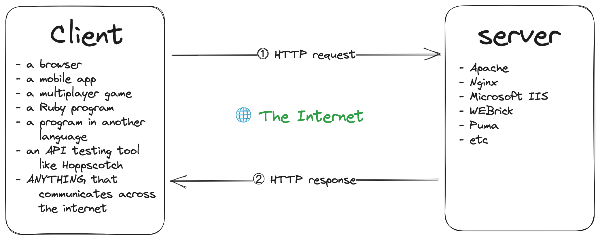

# 📘 Mastering HTTP Requests in Ruby & Rails

## Table of Contents
1. [What is HTTP?](#what-is-http)
2. [HTTP Request & Response Anatomy](#http-request--response-anatomy)
3. [HTTP Methods](#http-methods)
4. [Headers, Query Params, JSON](#headers-query-params-json)
5. [Making HTTP Requests in Ruby](#making-http-requests-in-ruby)
6. [Error Handling and Status Codes](#error-handling-and-status-codes)
7. [Summary & Exercises](#summary--exercises)

---

## What is HTTP?
HTTP (HyperText Transfer Protocol) is the language used for communication between **clients** (browsers, apps) and **servers** (Rails apps).

**Client ↔ Server Model:**

```
Client (Browser/App)
      ↓ HTTP Request
Server (Application)
      ↑ HTTP Response
```



**Example:** A browser asks: "Give me user #1" → Application responds with JSON data of that user.

---

## HTTP Request & Response Anatomy

### HTTP Request
```
GET /users/1 HTTP/1.1
Host: example.com
Content-Type: application/json
Authorization: Bearer token123
```
**Parts:**
- Method (GET, POST, PUT, PATCH, DELETE)
- Path (/users/1)
- Headers (metadata: auth, content-type, etc.)
- Body (for POST/PUT/PATCH)

### HTTP Response
```
HTTP/1.1 200 OK
Content-Type: application/json

{ "id": 1, "name": "Adolfo Nava" }
```

**Parts:**
- Status code (200, 404, 500, etc.)
- Headers
- Body (data payload)

---

## HTTP Methods

| Method | Action | Example |
|--------|--------|---------|
| GET    | Read data | `/users` |
| POST   | Create data | `/users` |
| PUT    | Replace data | `/users/1` |
| PATCH  | Update part of data | `/users/1` |
| DELETE | Remove data | `/users/1` |

---

## Headers, Query Params, JSON

### Query Parameters
```ruby
require 'uri'

uri = URI("https://example.com/search")
uri.query = URI.encode_www_form({ query: "ruby", page: 2 })
puts uri
```

### Custom Headers
```ruby
require 'net/http'
uri = URI("https://example.com")
req = Net::HTTP::Get.new(uri)
req['Authorization'] = "Bearer token123"
```

### JSON Serialization
```ruby
require 'json'
user = { name: "Brian", age: 27 }
json = JSON.generate(user)   # Serialize
hash = JSON.parse(json)      # Deserialize
```

---

## Making HTTP Requests in Ruby

### Net::HTTP
```ruby
require 'net/http'
require 'json'
uri = URI("https://jsonplaceholder.typicode.com/posts/1")
response = Net::HTTP.get(uri)
data = JSON.parse(response)
puts data["title"]
```

---

**Flow:** Client → Router → Controller → Model → Response (JSON)

---

## Error Handling and Status Codes

**Status codes examples:**
| Code | Meaning |
|------|---------|
| 100 | Continue |
|101 | Switching Protocols |
| 200  | OK |
| 201  | Created |
| 204  | No Content |
| 302 | Found |
| 400  | Bad Request |
| 301 | Moved Permanently |
| 401  | Unauthorized |
| 403 | Forbidden |
| 404  | Not Found |
| 405 | Method Not Allowed |
| 429 | Too Many Requests |
| 500  | Internal Server Error |
| 502 | Bad Gateway |
| 503 | Service Unavailable |
| 504 | Gateway Timeout |
| 1xx | Informational Responses | 
| 2xx | Success Codes |
| 3xx | Redirection Codes |
| 4xx | Client Error Codes Indicate that the client appears to have made an error. |
| 5xx | Server Error Codes Indicate that the server failed to fulfill a valid request. |

**Rescue network errors:**
```ruby
require 'net/http'
begin
  Net::HTTP.get(URI("https://example.com"))
rescue SocketError, Net::OpenTimeout => e
  puts "Network error: #{e.message}"
end
```

---

## Mini Project
**Task:** Fetch posts from `https://jsonplaceholder.typicode.com/posts` and display titles in ruby console or webpage.

---

## Advanced Learner Box
- Async HTTP requests using threads or background jobs (Sidekiq, ActiveJob)
- Using Faraday middleware for logging or retries
- Explore HTTP/2 and keep-alive for performance

---

## Summary & Exercises
- Understand HTTP request/response structure
- Understand Request Codes
- Practice using Net::HTTP

